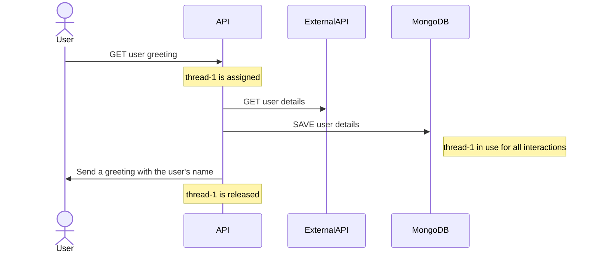
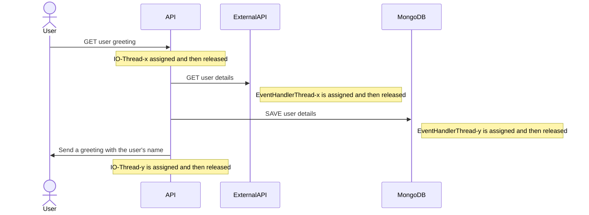

---
# try also 'default' to start simple
theme: light-icons
class: 'text-center'
highlighter: shiki
# show line numbers in code blocks
lineNumbers: false
# some information about the slides, markdown enabled
# persist drawings in exports and build
drawings:
  persist: false
# use UnoCSS (experimental)
css: unocss
transition: slide-left
hideInToc: true
---

# Improving the performance of a SpringBoot Web application

Workshop - Working Software 2023

Edward Popescu

<div class="abs-br m-6 flex gap-2">
  <a href="https://github.com/edwardpopescu/spring-boot-performance-workshop" target="_blank" alt="Code on GitHub"
    class="text-xl slidev-icon-btn opacity-50 !border-none !hover:text-white">
    <carbon-logo-github />
  </a>
</div>

<!--
The last comment block of each slide will be treated as slide notes. It will be visible and editable in Presenter Mode along with the slide. [Read more in the docs](https://sli.dev/guide/syntax.html#notes)
-->

---

# Intro

```ts
$ whoami
```

<i class="light-icon-home"></i> Bucharest, Romania
<br>
<br>
<i class="light-icon-currency-dollar"></i> Development Chapter Lead @ ING Hubs Romania
<br>
<br>
<i class="light-icon-heart"></i> Passionate about Java, Spring, Web apps, Security

<!--
You can have `style` tag in markdown to override the style for the current page.
Learn more: https://sli.dev/guide/syntax#embedded-styles
-->

---
hideInToc: true
---

# Agenda
<br>
<Toc></Toc>

---

# Motivation

Why would this topic be relevant for software developers?

DDoS compliancy 🤔
<br>
<br>
Improving user experience <i class="light-icon-user-plus"></i>
<br>
<br>
Decreasing costs 💸
<br>
<br>
Modern Spring 💚

---

# Performance chain

Several layers of systems can affect an application's performance dramatically

<v-clicks>

- infrastructure
  - <font color="grey">network latency</font>
  - <font color="grey">old network devices</font>
  - <font color="grey">spaghetti infra design</font>
- hosting limitation
  - <font color="grey">low RAM</font>
  - <font color="grey">low CPU</font>
  - <font color="grey">old OS</font>
- poor application design
  - <font color="grey">obsolete versions of languages</font>
  - <font color="grey">obsolete versions of (web) frameworks</font>
  - <font color="grey">inefficient communication between frontend and backend</font>
  - <font color="grey">inefficient DB setup (connection pools, join queries)</font>

</v-clicks>

<!--
Do you know other examples?
-->

---
layout: center
---

# Demo project & coding

<center>
  <a href="www.qr-code-generator.com/free-generator/?gclid=EAIaIQobChMIgNLHhsXn_wIVGNd3Ch25CQgpEAAYAiAAEgLaJPD_BwE&campaignid=9865629596&adgroupid=101327413838&cpid=0a31469f-6bd0-45cf-95c7-3455ec1767f4&gad=1"></a>
</center>

---
hideInToc: true
---

# Sequence diagram Spring-basic

Thread usage during an API call - ***Thread per Request Model***




---
hideInToc: true
---

# Sequence diagram Spring Webflux

Thread usage during an API call - ***Event Loop Model***




---

# Extras
What else could we improve?
<v-clicks>

- update to latest versions of your software
- go async as much as possible
- research improvement areas
  - <font color="grey">metrics (Micrometer, SpringBoot Actuator)</font>
  - <font color="grey">profiling and benchmarking: Intellij, JMH (Java Microbenchmark Harness), VisualVM</font>
- system redesign
  - <font color="grey">monolith vs. microservices</font>
  - <font color="grey">different API call order</font>
- using caching (browser, Redis)
- using CDNs, image/static content optimization, GZIP, HTTP/2 and 3
- code optimization

</v-clicks>

---

# Q&A

<div id="qa" class="qa">
  
</div>

<style>
.qa {
  height: 30%;
  width: 30%;
  display: block;
  margin-left: auto;
  margin-right: auto;
}
</style>

---

# Learn More

Resources

[Spring Webflux](https://docs.spring.io/spring-framework/reference/web/webflux.html)

[Reactive with Spring](https://spring.io/guides/gs/reactive-rest-service/)

[MongoDB Reactive](https://www.mongodb.com/docs/drivers/reactive-streams/)

[Spring 6 and SpringBoot 3](https://spring.io/blog/2022/05/24/preparing-for-spring-boot-3-0)

[Project on Github](https://github.com/edwardpopescu/spring-boot-performance-workshop)

[Presentation on Github](https://github.com/edwardpopescu/spring-boot-performance-workshop-slides)

[Presentation powered by Slidev](https://sli.dev)
